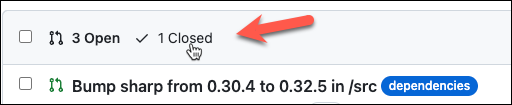

# Accelerated Innovation: Coding Practices for the Modern Developer

Welcome to the Accelerated Innovation workshop. This 60-minute guided workshop is designed to help you learn how to use the suite of GitHub products together to improve your development experience.

## Overview

You are a developer on a team that has created a TypeScript-based web application which displays an [Octocat](https://octodex.github.com/nuxtocat/) and a short message. In this workshop, you'll learn how to create and share a preconfigured development environment using Codespaces, how to package the application using GitHub Actions, and how to use GitHub Advanced Security and GitHub Copilot to identify and remediate security vulnerabilities in your code.

## Exercises

The following exercises are intended to be completed in order. Each exercise builds on the previous one. If you get stuck, feel free to ask for assistance!

- [Exercise 1 - Codespaces](#exercise-1---codespaces)
- [Exercise 2 - Installing extensions and customizing startup](#exercise-2---installing-extensions-and-customizing-startup)
- [Exercise 3 - Running the project](#exercise-3---running-the-project)
- [Exercise 4 - Finding bugs with GitHub Copilot Chat](#exercise-4---finding-bugs-with-github-copilot-chat)
- [Exercise 5 - Creating a GitHub Action](#exercise-5---creating-a-github-action)
- [Exercise 6 - GitHub Advanced Security](#exercise-6---github-advanced-security)

Additional exercises (not covered in the workshop):

- [Exercise 7 - Dependabot updates](#exercise-7---dependabot-updates)

### Exercise 1 - Codespaces

Typically, development environments can require a significant amount of setup time. Typically, development teams rely on documentation to help new developers get started. This includes configuring the operating system, configuring the IDE with required extensions, and customizing the environment to optimize it for each developer and project. This process can be time consuming and error prone. If multiple projects and configurations are required, this can be a significant burden on the team.

With most production environments, we solve this problem using infrastructure-as-code. GitHub Codespaces provides a similar solution for development environments. In this exercise, you'll create a Codespace for your repository and configure it to use a preconfigured development environment.

1. In GitHub, click *Code* to open the *Codespaces* tab. Click *Create codespace on main*.

   

   You have now created a basic Codespace. Next, you want to configure it for your specific project to make it shareable.

1. `Ctrl+Shift+P` (Windows) or `Shift+Cmd+P` (`⇧⌘P`, Mac) to open the Command Palette. Select *Codespaces: Add Dev Container Configuration Files...* and press Enter. This will start a wizard to help you configure your Codespace.

   > **Note**  
   > You can type `dev` or `codespaces` on the prompt (without pressing *Enter*) to filter the list of options.

   

1. Select *Create a new configuration…*. From the list of options, choose *Node.js and TypeScript**. You will then be prompted to choose a version; select *18-bookworm*. This configures the environment to use Node.js 18 and Debian 12 (Bookworm).

   

1. On the *Select Features* prompt, press *OK*. This will create a `.devcontainer` folder with a `devcontainer.json` file and a `Dockerfile`. 

   

1. When you are prompted to rebuild the container, select *Rebuild*.

   

   If you don't see this prompt, you can rebuild the container by opening the Command Palette and selecting *Codespaces: Rebuild Container*.   

### Exercise 2 - Installing extensions and customizing startup

Now that you have a basic developer container configured, you can customize it for your project. The generated `devcontainer.json` file contains additional information for optimizing the container. Many development projects require developers to manually prepare the environment to ensure that it is ready for you to get started developing. For example, to develop a Node.js application you must first run `npm install` to install the dependencies. Many projects also rely on specific extensions to be installed in the IDE to support the developer. In this exercise, you'll add some additional commands to the `devcontainer.json` file to automate these steps.

As part of this exercise, you will configure Visual Studio Code to install extensions in the container during its startup. The extensions will be configured for all developers. They will only exist within this container. The extensions that will be added:

   | Extension                      | Description                                      |
   | ------------------------------ | ------------------------------------------------ |
   | `GitHub.copilot-chat`          | GitHub Copilot / GitHub Copilot Chat             |
   | `dbaeumer.vscode-eslint`       | Integrates ESList static analyzer                |
   | `ms-azuretools.vscode-docker`  | `Dockerfile` editing support                     |
   | `EditorConfig.EditorConfig`    | Support for defining and enforcing coding styles |
   | `Github.vscode-github-actions` | Support for editing GitHub Actions workflows     |


1. In the `.devcontainer` folder, open the `devcontainer.json` file.

1. Add a comma at the end of the line that starts with `"image"`, then paste the following on the next line:

   ```json
   "customizations": {
       "vscode": {
           "extensions": [
               "GitHub.copilot-chat",
               "dbaeumer.vscode-eslint",
               "ms-azuretools.vscode-docker",
               "EditorConfig.EditorConfig",
               "Github.vscode-github-actions"
           ]
       }
   },

   "onCreateCommand": {
        "npm-update": "npm install -g npm@latest"
   },

   "postCreateCommand": {
        "npm": "cd ${containerWorkspaceFolder}/src && npm i"
    }
   ```

   You'll notice that this customization is specific to Visual Studio Code. Configuration preferences for other IDEs and host environment (including Codespaces!) can also be specified in `customizations`.

    <details>
    <summary>Solution</summary>
    
    The complete file should look like this:

    ```json
    // For format details, see https://aka.ms/devcontainer.json. For config options, see the
    // README at: https://github.com/devcontainers/templates/tree/main/src/typescript-node
    {
        "name": "Node.js & TypeScript",
        // Or use a Dockerfile or Docker Compose file. More info: https://containers.dev/guide/dockerfile
        "image": "mcr.microsoft.com/devcontainers/typescript-node:1-18-bookworm",

        "customizations": {
            "vscode": {
                "extensions": [
                    "GitHub.copilot-chat",
                    "dbaeumer.vscode-eslint",
                    "ms-azuretools.vscode-docker",
                    "EditorConfig.EditorConfig",
                    "Github.vscode-github-actions"
                ]
            }
        },

        "onCreateCommand": {
            "npm-update": "npm install -g npm@latest"
        },
    
        "postCreateCommand": {
            "npm": "cd ${containerWorkspaceFolder}/src && npm i"
        }
        
        // Features to add to the dev container. More info: https://containers.dev/features.
        // "features": {},
    
        // Use 'forwardPorts' to make a list of ports inside the container available locally.
        // "forwardPorts": [],
    
        // Use 'postCreateCommand' to run commands after the container is created.
        // "postCreateCommand": "yarn install",
    
        // Configure tool-specific properties.
        // "customizations": {},
    
        // Uncomment to connect as root instead. More info: https://aka.ms/dev-containers-non-root.
        // "remoteUser": "root"
    }
    ```
   </details>

1. You will be prompted to rebuild the container. Select *Rebuild*. If you don't see this prompt, you can rebuild the container by opening the Command Palette and selecting *Codespaces: Rebuild Container*. 

1. Once the container is restarted, open the *Extensions* view container. You should see all of the configured extensions installed. This process runs after the container has started, and it can take a few moments to complete.

   

1. The `onCreateCommand` installs the latest version of `npm` immediately after the container is created. This command is only run once. The `postCreateCommand` installs the dependencies for the project using `npm`. It runs after a development container has been created when it is being opened by a user. It also runs if the source tree has been modified. Both of these commands run inside the container. After the container restarted, you'll see these tasks execute in the *Terminal* panel as the container is started.
   
   In the *Explorer* view container, expand the `src` folder. You'll notice that that a `node_modules` folder has been created and that the dependencies have been installed.

   

1. Now you will commit these changes to your repository so that the configuration is used by other developers on your team. Open the *Source Control* view container by clicking the source control icon in the left sidebar ().

   

1. Hover over the *Changes* section header to see the `+` (add) icon, then click that icon to stage your changes. 

   

1. Next, enter a commit message (such as "Dev container files") at the top of the Source Control panel. Then click the blue *Commit* button.

    
  
   This adds the changes to the local repository inside the container. You can now push these changes to the remote repository.

1. The *Commit* button has changed to *Sync Changes*. Click that button to push the changes to the remote repository, making your changes available to other developers.

   

### Exercise 3 - Running the project

You've now created an environment that is ready for development. Once these changes are committed and pushed back to the repository, any developer can open the project in the container and immediately start developing. There's still a lot more for you to explore. For example, there are numerous additional options available to customize the container or to enable users to automatically customize their environment.

Now, let's see the project running.

1. Press *F5* to start the debugger. This will start the project.

1. A prompt will be displayed indicating the application is running. Click *Open in Browser* to open the application in a new browser tab.

   

1. You should now see an Octocat with a special message.

This project contains a `.vscode` folder which includes configuration settings that enable Visual Studio Code to launch and debug the application, assuming it is running in a properly configured development environment. By creating this environment in our dev container in Codespaces, we can build and debug our application in an isolated, ready-to-run environment. Notice that Codespaces automatically creates a tunnel to this environment to enable developers to debug and browsing the application as if it was running on a local machine.

### Exercise 4 - Finding bugs with GitHub Copilot Chat

GitHub Copilot Chat is a GitHub App that provides a chat interface for GitHub Copilot. It can be used to find bugs in your code, to identify security vulnerabilities, and to suggest improvements. In this exercise, you'll use GitHub Copilot Chat to identify a security vulnerability in your code.

The code in this project creates a unique `id` on the HTML page by using the text passed after the first `/` in the URL. Because the code is not validating the input, it is possible to inject additional HTML into the page. This can be used to inject malicious or content into the page. For example, the URL `http://localhost:20231/hello%0d%0a` will inject a new line into the page.

1. Click the GitHub Copilot Chat icon on the left side.

   

1. Click inside the prompt are lableled *Ask Copilot a question or type '/' for topics*.

   

1. Open the file `index.ts` in the `src` folder. Highlight lines 27-43.

1. Type `Is there a security issue in the selected code?` and press Enter.

   Copilot may provide one of multiple different responses. The response will generally be similar to one of the following:

   > Based on the code snippet you provided, there is a potential security issue. The `id` parameter is not validated before being used in the HTML response. This can lead to security vulnerabilities such as cross-site scripting (XSS) attacks. It's important to validate user input and sanitize it before using it in any way…

   > Yes, there is a potential security issue in this code. The `id` parameter is being used to construct an img tag, which could potentially be used to inject malicious content. An attacker could potentially inject a script tag as the `id` parameter value, which would execute when the page is loaded and could be used to steal sensitive information or perform other malicious actions. To prevent this, it is recommended to validate the `id` parameter …

   In both of these cases, it will explain the problem and offer a solution.
   
   In some cases, you may also see a response like one of these:

   > I don't see any obvious security issues in this code. However, it's always a good practice to sanitize user input to prevent any potential security vulnerabilities.

   > The highlighted code doesn't contain any obvious security issues. However, it's important to ensure that the id parameter doesn't contain any malicious code, as it's being used directly in the HTML. It's a good practice to sanitize user input to prevent any potential security vulnerabilities.

   In these cases, it has recognized that there is a potential for an issue and encourages you to review the code for a possible exploit. It offers some ways to improve the code. GitHub Copilot continues to improve in its ability to detect and explain security issues.

1. Type `Is there a better way to write this code?` and press *Enter*.

   Copilot offers some suggestions for improving the code and making it easier to maintain and modify. It may suggest using a template file (instead of a template literal). It may also suggest using the OR (`||`) operator instead of coalescing (`??`) to improve readability.

### Exercise 5 - Creating a GitHub Action

To further refine our project, we want to create a GitHub Action that will compile the TypeScript code to JavaScript, run the unit tests to validate the code, and package the results to a ZIP for deployment. These steps will ensure that the project is always in a good state and that we can quickly identify any issues. 

In this exercise, you'll create a GitHub Action that will build and test the project. At this point, you can exit the Codespace and return to the repository on GitHub. We'll do all of our remaining exercises in the main GitHub interface.

1. In your repository on GitHub, click the *Actions* view container.

   

1. You will see a number of suggested workflows displayed. Click *Set up a workflow yourself* at the top of the page.

   

   This will create a new Actions workflow file in `.github/workflows`.

1. Rename the file to `package.yml`.

   

1. Paste the following into the `package.yml` file:

   ```yml
   name: Package
   
   on:
     push:
         branches:
           - main

   permissions:
     contents: read
   ```

   This defines an Actions workflow named "Package". It will be triggered every time there is a  push to the `main` branch. In addition, the workflow will run with least privileges; it will only have access to read the contents of the repository. This is a best practice to ensure that the workflow cannot accidentally modify the repository. The workflow also automatically gets permission to store artifacts (such as the ZIP package) in the workflow run.

1. Create a job that will run in response to this event by pasting the following into `package.yml`:

   ```yml
   jobs:
     package:
       runs-on: ubuntu-latest
       steps:
         - name: Create package
         - uses: actions/checkout@v4
         - name: Setup Node
           uses: actions/setup-node@v3
           with:
             node-version-file: src/.nvmrc
             cache: npm
             cache-dependency-path: src/package-lock.json
         - name: Setup NPM
           working-directory: ${{ github.workspace }}/src
           run: npm install -g npm@latest
         - name: Install dependencies
           working-directory: ${{ github.workspace }}/src
           run: npm ci
         - name: Run tests
           working-directory: ${{ github.workspace }}/src
           run: |
             npm test
         - name: Package
           working-directory: ${{ github.workspace }}/src
           run: |
             npm run package        
         - name: Store Artifact
           uses: actions/upload-artifact@v3
           with:
             name: package
             path: ${{ github.workspace }}/src/publish/package.zip
   ```

   A job with the name "Create package" (and the identifier `package`) will run on an Ubuntu machine (runner) and will perform the following steps:

   - Checkout the code from the repository.
   - Setup Node.js using the version specified in the `.nvmrc` file and enable NPM dependency caching to speed up future builds.
   - Update to the latest version of NPM.
   - Restore all of the project's dependencies.
   - Run the unit tests by calling `npm test`, failing the workflow if any test fails.
   - Build the ZIP package by calling `npm run package`.
   - Store the ZIP file to the workflow run as an artifact called `package`.

1. Now you need to commit your changes to the repository. Click the *Commit changes...* button.

   

1. In the dialog that appears, click *Commit changes*. 

   

1. Since this file includes a `push` trigger, the commit will trigger the workflow to run. You can review the results by opening the repository on GitHub, then clicking the *Actions* tab.

   

<details>
   <summary>Solution</summary>
    
   The complete file should look like this:

   ```yml
   name: Package
   
   on:
     push:
         branches:
           - main
   
   permissions:
     contents: read
   
   jobs:
     package:
       name: Create package
       runs-on: ubuntu-latest
       steps:
         - uses: actions/checkout@v4
         - name: Setup Node
           uses: actions/setup-node@v3
           with:
             node-version-file: src/.nvmrc
             cache: npm
             cache-dependency-path: src/package-lock.json
         - name: Setup NPM
           working-directory: ${{ github.workspace }}/src
           run: npm install -g npm@latest
         - name: Install dependencies
           working-directory: ${{ github.workspace }}/src
           run: npm ci
         - name: Run tests
           working-directory: ${{ github.workspace }}/src
           run: |
             npm test
         - name: Package
           working-directory: ${{ github.workspace }}/src
           run: |
             npm run package        
         - name: Store Artifact
           uses: actions/upload-artifact@v3
           with:
             name: package
             path: ${{ github.workspace }}/src/publish/package.zip
   ```
   </details>

### Exercise 6 - GitHub Advanced Security

Securing the code is an important part of the process. In this exercise, you'll enable GitHub Advanced Security features to identify and remediate security vulnerabilities in your code. There are two key areas we will explore:

- Code Scanning - Identify vulnerabilities in your code based on an analysis of the code.
- Dependabot - Identify dependencies that have known vulnerabilities and suggest updates.

We'll start by enabling Dependabot.

1. Click the *Settings* tab in the main menu bar.

   

1. On the left side, click *Code security and analysis*.

   

1. Ensure that *Dependency graph*, *Dependabot alerts*, and *Dependabot security updates* are enabled. If any of these have an *Enable* button beside them,press the button to enable the feature.

    

Now we will enable Advanced Security and Code Scanning.

1. Scroll down the page to the *GitHub Advanced Security* section. Click *Enable*.

   

1. Confirm the choice by pressing *Enable GitHub Advanced Security for this repository*.

   

1. When the page reloads, scroll down to the *Code scanning* section under *GitHub Advanced Security*. Click *Set up* beside *CodeQL analysis*. Then, choose *Default*.

   

1. The *CodeQL default configuration* dialog will be displayed. We want to change one default setting, so click the *Edit* button

   

1. Under *Query suites*, selected *Extended* to enable additional queries. Then, click *Enable CodeQL*.

   

1. The button beside *CodeQL analysis* will update to *Setting up*. This process may take several minutes. You may need to refresh the screen to see the updated status. When it is complete, the press the *...* button and choose *View Code Scanning alerts*.

   

1. You should see two alerts displayed. One is similar to the earlier Copilot finding -- the `id` parameter can be used to create a reflected cross-site scripting attack. CodeQL also detects that the `id` parameter is being written to a log file, creating a log injection exploit. Take a moment to review the alert details, including the details about the code flow that is causing each issue.

   

1. On the left side under *Vulnerability alerts*, you should see that Dependabot has identified an additional issue. Click *Dependabot* to review those alerts.

   

1. The *Dependabot alerts* screen shows that the version of `Sharp` being used has a known vulnerability. It also shows that a pull request has been created to update the dependency.

   

1. Click the pull request to review the changes. You'll see that this PR attempts to update the version of `Sharp` to the first available version that does not have a known vulnerability. In this case, it is updating from `0.30.4` to `0.30.5`.

   

You've now seen GitHub Advanced Security in Action. In addition, it's discovered three vulnerabilities in the code base that we need to remedy. There is another feature that we can enable to help us avoid some issues in the future: Dependabot updates.

## Additional Exercises

GitHub has many features to explore — too many to cover in a single workshop! This section contains an additional exercise you can try on your own to learn more.

### Exercise 7 - Dependabot updates

In the previous exercise, you enabled Dependabot to identify dependencies that have known vulnerabilities. One way to avoid security vulnerabilities is to ensure that you are using the latest versions of your dependencies. When vulnerabilities are continuously updated, it would be less likely to have a known vulnerability. By configuring Dependabot updates, we can automatically create pull requests to keep our dependencies up-to-date.

In this exercise, you'll enable Dependabot to automatically update dependencies in your project. Dependabot will monitor your dependencies and notify you when there are updates available. You can configure it to automatically create pull requests to update the dependencies.

1. Click the *Settings tab* in the main menu bar.

1. On the left side, click *Code security and analysis*.

1. Click the *Enable* button for *Dependabot version updates*.

   

1. Click the link below *Dependabot version updates* to create the `.github/dependabot.yml` config file.

   

1. Replace the contents of the file with the following:

    ```yml
    version: 2
    updates:
      - package-ecosystem: "npm"
        directory: "/src" # Location of package manifests
        schedule:
          interval: "weekly"
    ```

    This configuration file tells Dependabot to monitor the src folder (`/`) for updates to NPM packages (using `package.json` and `package-lock.json`). It will check for updates weekly. This file supports lots of additional configuration options for fine tuning your policies to meet your needs.

    

1. Click *Commit changes...*. In the popup that appears, click *Commit changes*.

   

1. Go to the *Pull requests* tab. Periodically, refresh the screen. After a short time, notice that the *Pull requests* tab shows an increase in the number of PRs. You'll see new PRs such as:

   - Bump sharp from 0.30.4 to 0.32.5 in /src
   - Bump @types/node from 20.5.9 to 20.6.2 in /src
   - Bump jest and @types/jest in /src

   
     
   > **Note** 
   > The specific versions shown may be different based on the releases of the dependencies.

1. Notice that there is also 1 closed PR. Click *1 Closed* to view the list of closed PRs.

   

1. Notice that the original PR has been closed automatically.

   

   Opening the original PR, we can see why — it was superseded by the new PR.
   
   > **Note**  
   > The actual issue number displayed may be different.

   

1. Click the *Security* tab, then click *Dependabot*. You can also see that the Security update also indicates that the original PR was closed.

   

   This indicates that if you take the suggested version updates, it will also resolve this vulnerability. Feel free to return to the *Pull request* tab and merge the PR for updating `sharp`. Within a few moments, the Dependabot alert security alert will automatically be closed.

   

You've now learned how to configure Dependabot updates to help keep your dependancies up-to-date. You've also seen how this can proactively help you to avoid security issues.
